# TP5
Tecnología SAR: Inundaciones e índices de vegetación
- Universidad de Costa Rica 
- GF-0618 FOTOGRAMETRÍA Y TELEDETECCIÓN
- MSc.María José Molina Montero
- Estudiantes: Steven Guillén-Ana López

## Contenido teórico : Defina e Ilustre los siguientes conceptos

**Microondas**
- Las microondas en el espectro electromagnético abarcan longitudes de onda larga que van en el rango de 1cm y 1m. 
> las microondas tienen propiedades especiales que son importantes en la teledetección, debido a su mayor longitud de onda comparado con las señales ópticas y de infrarrojo. A mayores longitudes de onda la radiación de microondas puede penetrar a través de las nubes, polvo, neblina y lluvia, además estas longitudes de onda son menos susceptibles a la dispersión atmosférica, que afecta en gran medida a las señales ópticas (Canada Centre for Remote Sensing citado en Acevedo, 2011,p.02).

**Figura 1.**
Región de microondas en espectro electromagnético

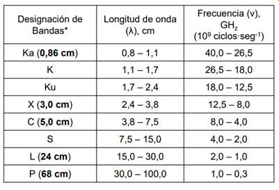
> Fuente: ARSET, 2020

Las ondas se identifican por su longitud de onda y frecuencia, junto a ello sobresalen parámetros como la amplitud, que es el máximo desplazamiento de una onda desde su posición de equilibrio. Además de la intensidad, entendida como el promedio de potencia transferida durante un período de onda. Las microondas operan en un rango de frecuencia mucho más bajo que las ópticas y reconocer su fase (posición en tiempo y espacio) es fundamental para entender su propagación en la superficie terrestre. (Applied Remote Sensing Training Program , 2020).

**Figura 2.**
Energía emitida por la Tierra y ventana atmosférica en la región de microondas
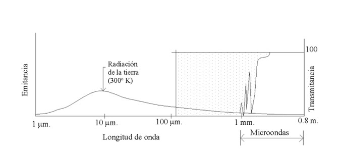
> Fuente: Ruíz, 2015

Esta ventana atmosférica permite que la señal emitida por la antena logre llegar a la superficie terreste evitando factores que alteran el pulso electromagnético. 

**Retrodispersión**
> “La energía retrodispersada (backscattered) recibida por el sensor se amplifica y procesa para obtener la posición, las propiedades eléctricas y las propiedades superficiales de los objetos” (Ruíz, 2015, p.02).
 
**Figura 3.**
Los tres tipos principales de dispersión considerados para los datos SAR. 

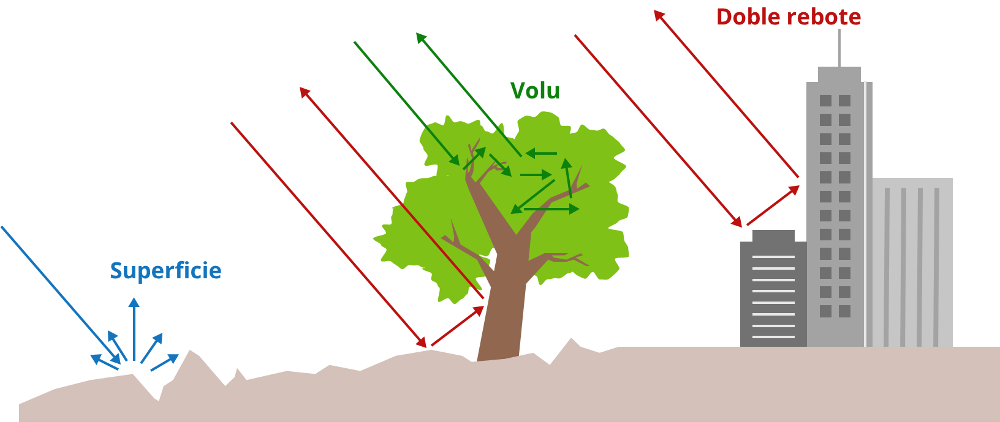

> Fuente: Meyer, 2019

Se puede entender como la energía dispersada de vuelta una vez que la señal ha interactuado con el objeto presente en la superficie. La retrodispersión puede disminuir con un mayor ángulo de incidencia, es decir, si un radar observa el mismo objeto a distintos ángulos la retrodispersión será distinta.

**Constante dieléctrica**

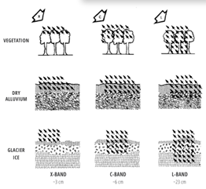

Este concepto esta sumamente relacionado con la retrodispersión pues las propiedades dieléctricas de un medio explican cómo una señal de microondas de longitud de onda interactúa con un medio de dispersión como la superficie de la Tierra o un dosel de vegetación. Estas propiedades dictan cuánto de la radiación entrante se dispersa en la superficie, cuánta señal penetra en el medio y cuánta de la energía se pierde en el medio a través de la absorción (Meyer, 2019).

**Bandas en RADAR para aplicaciones ambientales**

Comúnmente se utilizan polarizaciones lineales y los sensores SAR propagan o reciben energía con una polarización horizontal o vertical. La diferencia entre componentes perpendiculares es de cero grados evitando el desfase al momento de la propagación.

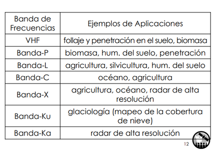

**Radar de Aértura Sintética**
Los radares de apertura sintética (SAR) generan imágenes radar de reflectividad de alta resolución. Estos sensores se basan en el uso de un radar (acrónimo de Radio Detection And Ranging). Es un sistema activo, es decir, genera su propia fuente de energía. Emiten una señal de microondas con propiedades conocidas y la fuerza de la energía retrodispersada por el objeto es detectada por el radar. Además de ello, los radares miden el tiempo que tarda la señal en viajar hasta la superficie terrestre y regresar a la antena, de esta forma determinan la ubicación un objeto.

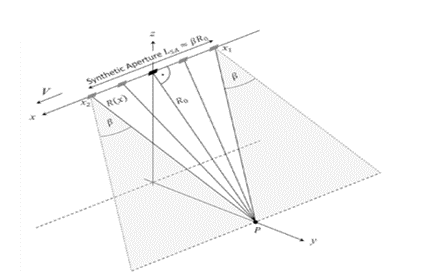

De acuerdo como Meyer (2019) a diferencia de la mayoría de los sistemas de imágenes ópticas, que apuntan sus sensores hacia el nadir, la antena de un radar apunta lejos del nadir por un llamado ángulo de mirada que ilumina una franja continua en el suelo a medida que la aeronave se mueve. Los SAR transmiten señales de microondas en un ángulo oblicuo y miden la parte retrodispersada (en la dirección del sensor) de esta señal, para analizar características en la superficie (p.1-5).

## Metodología
[Código en GEE Inundaciones](https://code.earthengine.google.com/eea6817e2f6e61a4680d05f9a7a1bee5)

[Código en GGE índice de Vegetación con Radar](https://code.earthengine.google.com/aae609a07c80fb869b729654ec96504a)

## Diagramas de flujos

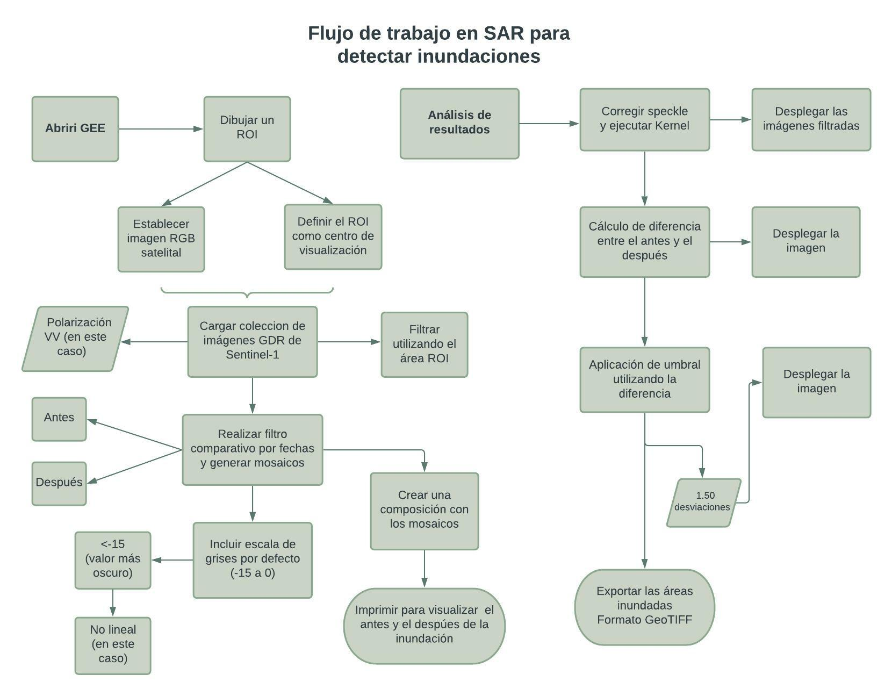

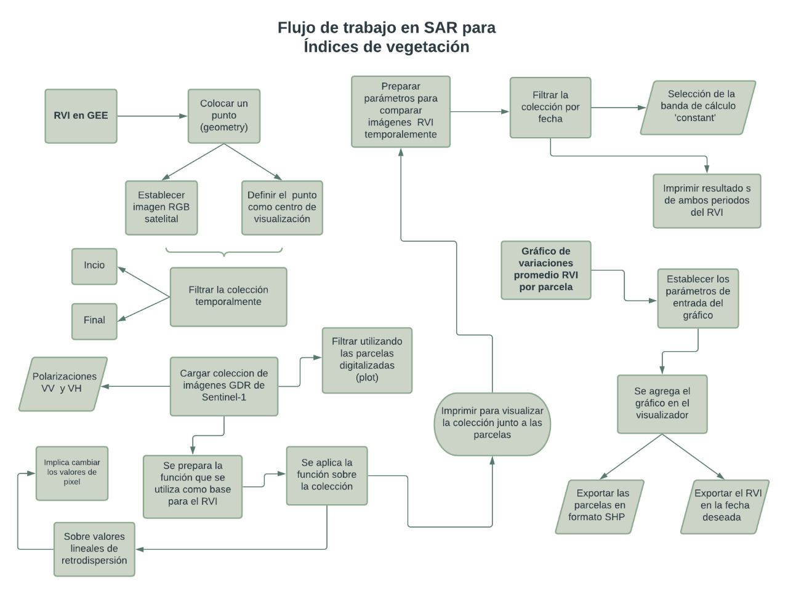

## Resultados y Conclusiones

### Detección de inundaciones
Para la detección de cambios y monitoreo de cuerpos de agua en grandes extensiones, la utilización de la banda C de Radar de Apertura Sintética (SAR) es muy efectiva. Además, utilizar esta tecnología permite, en un país tropical como el nuestro, acceder a imágenes sin distorsiones asociadas a nubes. La metodología de detección de cambios mediante mecanismos de retrodispersión junto al uso de un umbral adecuado, permitió conocer las áreas que fueron inundadas después del huracán Otto.
.

Al crear la composición de imágenes con la polarización VV del antes y el después de la inundación se pudo visualizar una gama de colores del morado al verde, en donde el morado corresponde a las zonas en las que antes de la inundación se veían brillantes y después del huracán se veían oscuras por la poca señal que volvía al sensor, los colores blancos corresponden a zonas donde no hubo cambio, y los colores verde a zonas en donde la retrodispersión aumentó y por tanto la señal, pero no significa que allí hubo una inundación del todo, sino que  quiere decir hay una superficie muy húmeda y rugosa, como por ejemplo el lago de la figura [].
### Indice de Vegetación por Radar (RVI)
Una vez ejecutado el código con bandas de polarización V-V y V-H. Al visualizar los datos y gráficos resultantes, el índice oscila entre 0 y 1 , los valores cercanos a 0 pueden referirse a coberturas lisas o descubiertas con colores rojos , en contraste, el crecimiento del índice se relaciona con mayor cobertura vegetal donde resaltan colores verdes y amarillos. El uso de distintas fechas facilita un análisis temporal pues los resultados en cada mes pueden evidenciar cambios en la vegetación, por ejemplo, el crecimiento de un cultivo que produce un aumento en el índice o por lo contrario puede evidenciar la presecia de plagas en los cultivos que pueden generar la pérdida de una plantación, además de ello,  un suelo liso que se prepara para el proceso de siembra arrojara índices más bajos. En el caso analizado hay un cambio claro en los niveles de retrodispersión posterior a la Zafra realizada en el cultivo de Caña de azúcar pasando a colores más rojos en el mes de marzo donde hay una disminución del RVI.

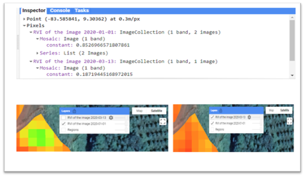
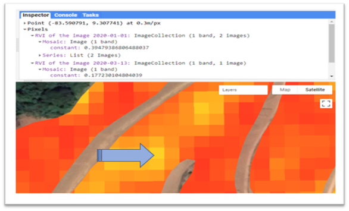

Se obtiene un gráfico con múltiples líneas pues se analizó cada polígono de las 27 fincas. Es un año de análisis que representa las diferencias en los niveles de retrodispersión. Es sumamente variable ya que puede responder a periodos de tiempo en los que se prepara el suelo para la siembra, otros meses con crecimiento vigoroso del cultivo con índices mayores. Además, es fundamental conocer si todas las fincas tienen el mismo patrón de siembra. Datos que solamente se pueden obtener en campo, por ello siempre se resalta la capacidad del profesional en Geografía para crear una relación entre los datos visualizados por medio de herramientas tecnológicas que luego deben ser corroborados en campo.

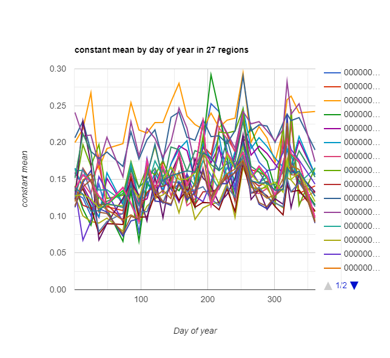

 
 figuras
